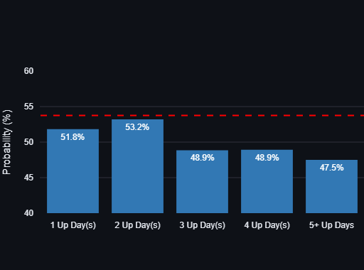

# Market Memory: Isolating Directional Noise from Volatility Clustering

An empirical quantitative framework using 25+ years of historical S&P 500 data to contrast market direction memory against market magnitude (volatility) memory. 

This repository provides an interactive, data-driven environment demonstrating that while market direction behaves as a near-perfect random walk, market risk (volatility) exhibits deep, persistent, and structurally predictable memory.

---

## 📈 Core Empirical Findings

### 🧪 Proof A: Direction Has No Memory (The Random Walk)
* **The Metric:** Conditional probabilities of a positive trading day $P(\text{Up Tomorrow} \mid \text{Streak} = N)$ across sequential 1-to-5+ day winning streaks.
* **The Reality:** Successive green days fail to compound directional momentum. The conditional probabilities hover tightly near the multi-decade historical baseline rate ($\sim53.78\%$). 
* **Statistical Nuance (Sample Size Decay):** While larger streak lengths (3, 4, and 5+ days) show a slight drop toward 47–49%, this fluctuation is driven by smaller sample sizes (rarer multi-day streak occurrences over a 25-year profile) rather than structural momentum regimes.

<p align="center">
  
</p>

### 🌪️ Proof B: Volatility Has Deep Memory (Clustering)
* **The Metric:** Annualized rolling standard deviation scaled to macro horizons to systematically map volatility clustering over time.
* **The Reality:** Risk is not constant; it aggregates into distinct, high-density regimes. The structural shifts are highly visible during major macroeconomic disruptions such as the 2008 Global Financial Crisis and the 2020 COVID-19 crash.

<p align="center">
  
</p>

### 📊 The Autocorrelation (ACF) Face-Off
* **Raw Returns (Left):** Directional serial correlation is completely chaotic and stays almost entirely trapped inside the $\pm 2/\sqrt{N}$ 95% confidence interval boundaries. It is statistically indistinguishable from white noise.
* **Absolute Returns (Right):** Conversely, price magnitudes shatter the noise threshold. Every single lag across the trading month stays heavily positive ($\sim0.25$ to $0.35$), providing definitive empirical validation for conditional variance models like GARCH.

<p align="center">
  
</p>

---

## 🛠️ Mathematical & Implementation Framework

### Phase 1: Advanced Preprocessing & Stationarity Mitigation
* **Historical Data Extraction:** Retrieved daily adjusted closing prices for the S&P 500 index (`^GSPC`) spanning a 25+ year horizon via the `yfinance` API.
* **Non-Stationarity Mitigation:** Raw asset prices ($P_t$) exhibit non-stationary, long-term macroeconomic trends that introduce severe **spurious correlation bias** into time-series analysis. To guarantee the mathematical validity of downstream statistical inferences, raw prices are differenced into stationary percentage return vectors:
  $$R_t = \frac{P_t - P_{t-1}}{P_{t-1}}$$
* **Magnitude Isolation:** Extracted absolute returns $|R_t|$ to completely strip away directional sign bias, cleanly isolating pure magnitude/volatility proxy variables for structural tracking.

### Phase 2: Directional Streak Analysis
* **Unconditional Base Rate Derivation:** Derived the exact empirical baseline probability of a positive trading day over the complete multi-decade dataset ($\sim53.78\%$). This slight positive skew represents the historical long-term drift premium of equity markets.
* **Vectorized Streak Processing:** Engineered a high-performance, vectorized loop using `NumPy` and `Pandas` to map and group historical consecutive rolling up/down clusters without iterative lag vulnerabilities.
* **Conditional Probability Profiling:** Evaluated directional dependence by filtering subsets by precise historic streak bounds:
  $$P(\text{Up Tomorrow} \mid \text{Streak} = N)$$

### Phase 3: Volatility Clustering & Autocorrelation Analytics
* **Risk Horizon Modeling:** Programmed an automated volatility scaling engine generating a 20-day rolling standard deviation metric, scaled into annualized parameters:
  $$\sigma_{\text{annualized}} = 100 \times \sigma_{\text{daily}} \times \sqrt{252}$$
* **Autocorrelation Function (ACF) Face-off:** Computed the serial correlation structures of both raw return vectors $R_t$ and absolute magnitude vectors $|R_t|$ up to 20 trading lags using `statsmodels.tsa.stattools.acf`.
* **Statistical Boundaries:** Plotted a standard $95\%$ statistical confidence interval boundary based on Bartlett's formula ($\pm 2/\sqrt{N}$, where $N$ represents the complete dataset row count) to formally isolate structural signal from stochastic noise.

---

## 🖥️ Interactive Dashboard (Streamlit & Plotly)

The entire analytical backend is mapped to a responsive, multi-panel production UI designed to let users interactively explore the limits of market memory in real time. 

### Dynamic Parameters Available:
* **Rolling Vol Window (Days):** Controls the low-pass filtering properties of the risk timeline graph. Modulating this slider showcases the core trade-off between smoothing signal noise and introducing chronological data lag.
* **Max Explored Streak Length:** Dynamically expands the conditional probability matrix to evaluate rare, extreme historical directional streaks.
* **Autocorrelation Lags (Days):** Modulates the X-axis tracking horizon of the ACF "echo detectors," allowing users to visually track the exact decay profile of volatility memory over weeks of trading history.

---

## 🚀 Repository Contents
- `finance_p1.ipynb`: Data engineering infrastructure, API pipeline extraction, and target feature transformation modules.
- `finance_p2 (1).ipynb`: Statistical analytics notebook executing conditional probability metrics, rolling volatility distributions, and formal time-series autocorrelation testing.
- `app.py`: Production-ready, interactive Multi-Panel Streamlit dashboard built on vectorized back-end metrics.

## 💻 How to Run Locally
1. **Clone the repository:**
   ```bash
   git clone [https://github.com/your-username/market-memory.git](https://github.com/your-username/market-memory.git)
   cd market-memory
